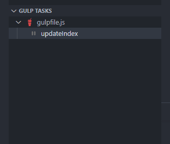
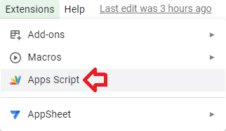

# Workflow Setup

Paperwork is an integral part for any company and that's where this system comes in to facilitate the means to make administration easier by linking everything on the cloud.

## NPM Install Commands for workflow (Gulp, Sass, jQuery & TypeScript)

    npm init -y

    npm install gulp
    npm install sass
    npm install jquery
    npm install typescript

    npm install --save-dev gulp
    npm install --save-dev gulp-sass
    npm install --save-dev gulp-clean
    npm install --save-dev gulp-concat
    npm install --save-dev gulp-uglify
    npm install --save-dev gulp-rename
    npm install --save-dev gulp-uglifycss
    npm install --save-dev gulp-typescript
    npm install --save-dev gulp-sourcemaps
    npm install --save-dev gulp-delete-file
    npm install --save-dev gulp-string-replace
    npm install --save-dev gulp-strip-css-comments

    npm install --save-dev @types/jquery

---

# Test First

## Visual Studio Code (Setup)

Press (Ctrl + ,) to open Settings and search for 'Exclude' to hide files and folders that clutter the workspace.
Alternative Way: File -> Preferences -> Settings -> Search for 'Exclude'

## Search for

## Gulp (Setup)

My code editor is [Visual Studio Code](https://code.visualstudio.com/) and 'gulpfile.js' is the file that contains the code to automate this workflow. I followed this [gulp crash course](https://www.youtube.com/watch?v=1rw9MfIleEg&ab_channel=TraversyMedia) and expanded on it to accommodate the layout of this folder. Gulp works well with the [Gulp Tasks](https://marketplace.visualstudio.com/items?itemName=nickdodd79.gulptasks) extension created by Nick Dodd by imbedding the written functions inside Visual Studio Code using the 'gulpfile.js' as reference. This is what it should look like inside the code editor if setup is done correctly.

The [npm commands website](https://www.npmjs.com/package/gulp) for Gulp is a great resource when adding extra features and you will also need to know what [Node.js](https://nodejs.org/en/) is before continuing further. The npm (Node Package Manager) commands for Gulp are listed below and can be copied and pasted into the terminal for easy installation.

---

## Clasp for Google Sheets (Setup)

This [video tutorial](https://www.youtube.com/watch?v=4Qlt3p6N0es&t=437s&ab_channel=LearnGoogleSheets%26ExcelSpreadsheets) for [Clasp](https://github.com/google/clasp) helped me setup [Google Sheets](https://www.google.com/sheets/about/) the workflow in order to link [Apps Script](https://developers.google.com/apps-script/reference/spreadsheet) with [Visual Studio Code](https://code.visualstudio.com/). I use google sheets as a front-end application to show statistics due to its ease of use when designing layouts. It's like Excel but with servers. Remember to enable your [Google Apps Script API](https://script.google.com/home/usersettings) to give Visual Studio Code permission to change any code associated with the project.

### NPM Install Commands for Clasp

    npm install --save-dev @google/clasp

Confirm if Clasp is installed by typing 'clasp -v' into the command prompt. If it it gives an error then you're allowed to shed a tear and read a [wikiHow](https://www.wikihow.com/Open-Terminal-in-Windows) on whatever the situation is...or quit for today and continue tomorrow. Get the project ID for the sheet you want to import by going into Apps Script. Type 'clasp login' into the terminal and press enter. This will open a browser for you to log into your account. Specify which the the Apps Script ID you want to link to Visual Studio Code by retrieving the ID inside the URL above the page.

    clasp -v
    clasp login

Retrieve the ID for the 'Apps Script Sheet' in the URL bar above the page after opening the extensions dropdown for Apps Script, shown below. Open '.clasp.json' file to replace the code with the relevant parameters for your workflow. Change the script ID (scriptId) from, "G3T*yOuR_ScR!pT_iD_aNd_C0Py*!t_H3rE", to the 'Apps Script ID' of the project. The examples below is where you can find the ID for the sheet. The file location of the root directory (rootDir) should also be replaced from, "enter/the/location/where/you/want/to/duplicate/the/files", to the relevant location for your workflow.

Go to your terminal to use the 'clasp clone' function and type in the following text into the Visual Studio Code terminal to store the JavaScript files imported from the cloud. Remember to match the information inside the '.clasp.json' file for the command to work. If done correctly then the application will clone the files and copy it over from the cloud and into your workflow for editing. As I mentioned before: The following command will differ depending on the folder layout used and the Apps Script sheet ID assigned to the project.
I will also list the default reference code to switch between different Apps Script projects for security purposes.

    clasp clone "G3T_yOuR_ScR!pT_iD_aNd_C0Py_!t_H3rE" --rootDir enter/the/location/where/you/want/to/duplicate/the/files

If you want to apply the code changes and save it onto the cloud then you can use the following commands. The application will reference the '.clasp.json' file inside the main folder of the project so remember to replace the following code, {"scriptId":"G3T*yOuR_ScR!pT_iD_aNd_C0Py*!t_H3rE","rootDir":"enter/the/location/where/you/want/to/duplicate/the/files"}, with the relevant information for the terminal to work properly.

    clasp pull
    clasp push -w

---

## TypeScript Module Imports (Setup)

## Links to pages

[Academics](https://tertiusroach.github.io/university-tracker/dist/pages/academics/index.html)
[Administration](https://tertiusroach.github.io/university-tracker/dist/pages/administration/index.html)
[Broadcasts](https://tertiusroach.github.io/university-tracker/dist/pages/broadcasts/index.html)
[Index](https://tertiusroach.github.io/university-tracker/dist/pages/index/index.html)

---

The [markdown cheat sheet](https://www.markdownguide.org/cheat-sheet/) for README.md

---

# Ateljee Admin 2023

## Bevat al die skakels wat ons nodig het om opdaterings te onderhou.

## Download project and unzip it into any folder before opening it with Visual Studio Code

---

# Step 1: Open Terminal in Visual Studio Code (Press: Ctrl + `)

    npm init

---

# Step 2: Input information such as version, description and keywords

---

# Step 3: Install Node.js frameworks: (npm Version 8.1.0)

## This creates a 'package-lock.json' file

    npm install --save-dev @gulp-sourcemaps/identity-map
    npm install --save-dev gulp-sourcemaps
    npm install --save-dev gulp-typescript
    npm install --save-dev gulp-npm-dist
    npm install --save-dev @types/jquery
    npm install --save-dev gulp-rename
    npm install --save-dev typescript
    npm install --save-dev gulp-sass
    npm install --save bootstrap
    npm install --save requirejs
    npm install --save-dev sass
    npm install --save-dev gulp
    npm install --save-dev fs
    npm install requirejs
    npm install -g gulp
    npm install jquery

---

# Step 3: Commit to Repository by using these commands inside of Visual Studio Code terminal

    echo "# sample-commit" >> README.md
    git init
    git add README.md
    git commit -m "first commit"
    git branch -M main
    git remote add origin https://github.com/TertiusRoach/sample-commit.git
    git push -u origin main

---

# Optional: This is how I set-up my workflow

## Step 4: Install Extensions for Visual Studio Code

# Press: Ctrl+Shift+X

    --Tabnine AI Autocomplete for Javascript, Python, Typescript, PHP, Go, Java, Ruby & more: TabNine
    --Code Spell Checker: Street Side Software
    --GitLens - Git supercharged: GitKraken
    --Prettier - Code formatter: Prettier
    --Bracket Pair Colorizer: CoenraadS
    --Material Icon Theme: Philipp Kief
    --Auto Rename Tag: Jun Han
    --Live Server: Ritwick Dey
    --One Dark Pro: binaryify
    --Gulp Tasks: Nick Dodd
    --Auto Import: steoates
    --Live Share: Microsoft
    --Quokka.js: Wallaby.js
    --ESLint: Microsoft
    --Python: Microsoft
    --C/C++: Microsoft

---

## Step 5: Exclude files generated by the back-end workflow.

# Top Left Dropdown: File -> Preferences -> Settings and Search for -> Exclude.

    types
    src/*.d.ts
    dist/**/*js.map
    dist/desktop.init
    package-lock.json

---

# ateljee-admin-2023

# ateljee-admin-2022

# ateljee-admin-2022



# workflow-setup
